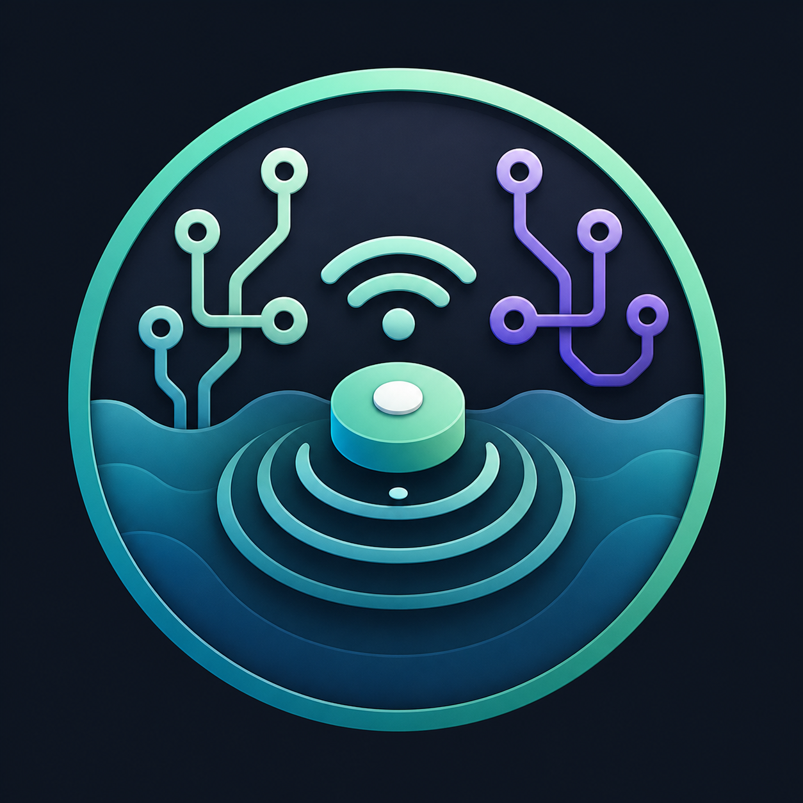

# nemonamo

Android, IoT, and small hardware ideas that become working prototypes.

안녕하세요. Android 앱, IoT 센서 데이터, 하드웨어 프로토타입을 연결하는 작업을 좋아합니다. 
아이디어가 그냥 설명으로 끝나지 않고, 센서에서 서버로, 다시 앱 화면으로 이어지는 형태가 되도록 만드는 쪽에 관심이 많습니다.

## What I Work On

- Android/Kotlin 기반 모바일 앱 개발
- Raspberry Pi, ESP32, 센서 모듈을 활용한 IoT 프로토타입
- Mobius oneM2M 기반 데이터 수집과 모니터링 앱 연동
- KiCad 기반 회로/보드 설계 실험
- 작은 프로젝트를 포트폴리오로 보기 좋게 다듬는 중

## Featured Projects

| Project | What It Is | Stack |
| --- | --- | --- |
| [SVMandroid](https://github.com/nemonamo/SVMandroid) | 스마트 자판기 상태를 Mobius oneM2M 서버와 Android 앱으로 모니터링하는 프로젝트 | Kotlin, Android, Retrofit, Mobius |
| [Smartfishing-Fishingod-](https://github.com/nemonamo/Smartfishing-Fishingod-) | 스마트 낚싯대 센서 데이터를 앱에서 확인하는 IoT 낚시 모니터링 프로토타입 | Kotlin, Firebase, Google Maps, Mobius |
| [esp32_bno085](https://github.com/nemonamo/esp32_bno085) | ESP32와 BNO085 센서를 활용한 하드웨어 설계 프로젝트 | KiCad, ESP32, Sensor |

## Tech I Use

`Kotlin` `Android` `Firebase` `Retrofit` `Python` `KiCad` `ESP32` `Raspberry Pi` `Mobius oneM2M`

## Current Focus

- 오래된 테스트 레포는 정리하고, 보여줄 프로젝트는 README와 설명을 정리하고 있습니다.
- Android 앱과 IoT 서버가 연결되는 프로젝트를 더 읽기 쉬운 포트폴리오 형태로 다듬고 있습니다.
- 센서/하드웨어 프로젝트도 앱과 함께 설명되는 방향으로 정리하고 있습니다.

## Contact

- GitHub: [@nemonamo](https://github.com/nemonamo)
